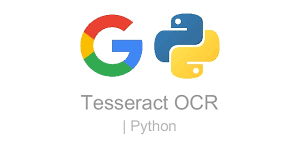

<p align="center">
    

  <h3 align="center">Aadhaar OCR using Tesseract</h3>

  <p align="center">

  </p>
</p>

## Table Of Contents

- [Table Of Contents](#table-of-contents)
- [About The Project](#about-the-project)
- [Getting Started](#getting-started)
  - [Prerequisites](#prerequisites)
  - [Installation](#installation)
- [Usage](#usage)
- [Authors](#authors)

## About The Project

This project is a Python-based tool designed to extract and digitize text information from Aadhar Cards, the unique identification cards issued by the Government of India. This project aims to facilitate the automation of data extraction from Aadhar Cards, making it easier to integrate Aadhar Card data into various applications, databases, and systems.

Developers and data analysts often need to test and develop Redash features, plugins, and customizations in a local environment before deploying to a production server. While Linux is the recommended platform for hosting Redash, this project aims to make it more accessible to Windows users for local testing and development.

****Disclaimer: The aadhaar samples used, were found on google using my internet search**

### Features

- Aadhar Card Text Extraction: The project includes OCR capabilities that can accurately extract text from Aadhar Cards, including important information such as the Aadhar number, holder's name, date of birth, and address. This OCR functionality is powered by Tesseract, an open-source OCR engine known for its accuracy and versatility in text recognition.

- Customization: Users have the flexibility to customize the OCR process to accommodate variations in Aadhar Card formats and designs.

- Open Source: This project is open source and can be freely used, modified, and extended by the community.
<br />
<p align="center">

</p>

## Getting Started

### Prerequisites

1. [Python 3.7.9](https://www.python.org/downloads/release/python-379/) Make sure you have Python 3.7.9 installed on your system. You can download and install Python from the official Python website.
2. [Git](https://git-scm.com/download/win)
3. [Tesseract OCR](https://github.com/tesseract-ocr/tessdoc/blob/main/Downloads.md): Tesseract is used for text extraction. Install Tesseract for your operating system by following the instructions on the Tesseract GitHub repository.

### Installation

1. Clone the repo

```sh
git clone https://https://github.com/anujhsrsaini/Aadhar-OCR.git
```

*You can change the environment variables if you want but there isn't much need for it.*

2. It is recommended that you setup a completely new python environment from python 3.7.9 for this project, as the library versions in the requirements.txt may conflict with your prior installations, and install the required libraries to this environment using the below commands.

```sh
python -m venv venv
pip install -r requirements.txt
```

3. Make the changes to main.py file, to include your own Tesseract path and paths to front and back of Aadhaar image you want to process. You might need to make slight change to backside image part of the code based on the format of aadhaar you are using as mentioned in the commented part of the code.

4. Now, you can run the code and it will print out the processed information.

## Authors

- **[Anuj Saini](https://www.linkedin.com/in/anuj-saini-7230a0257/)**
